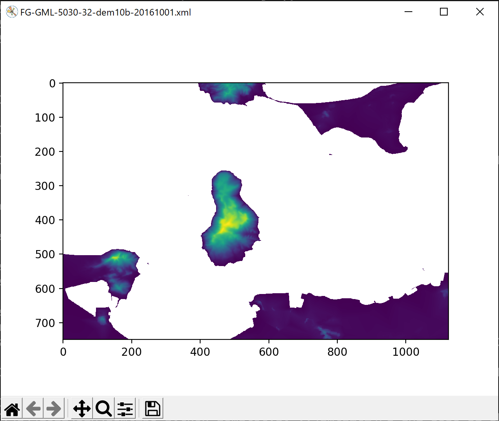
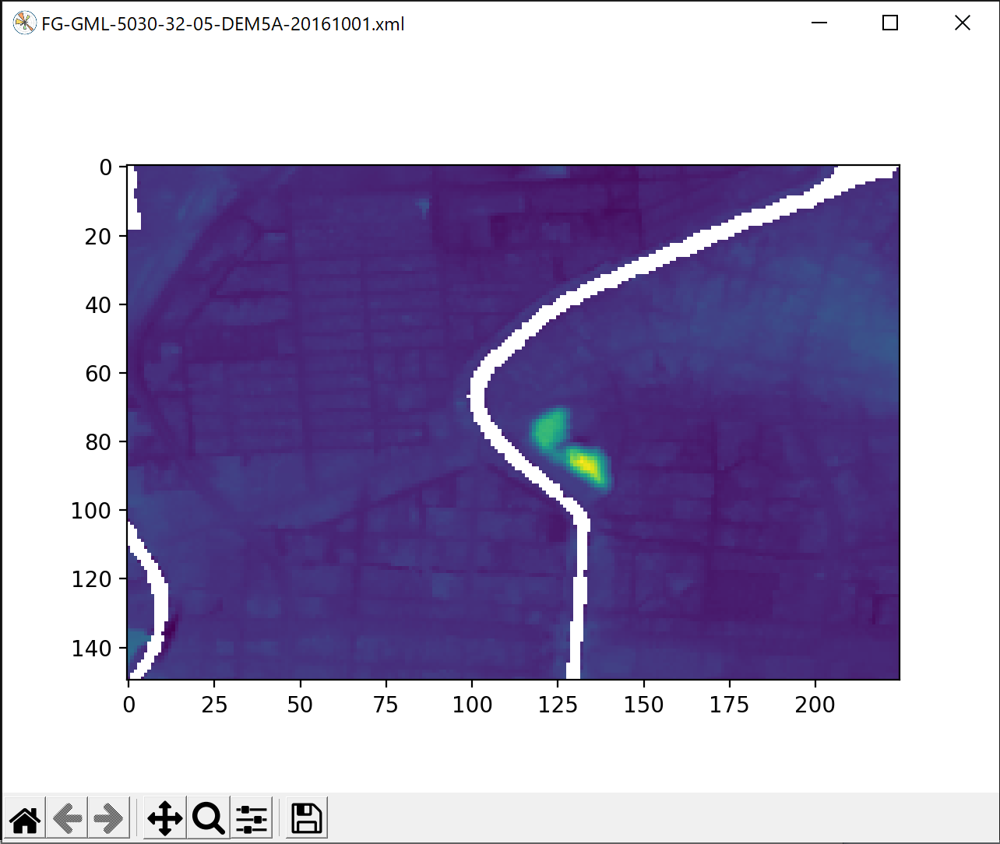
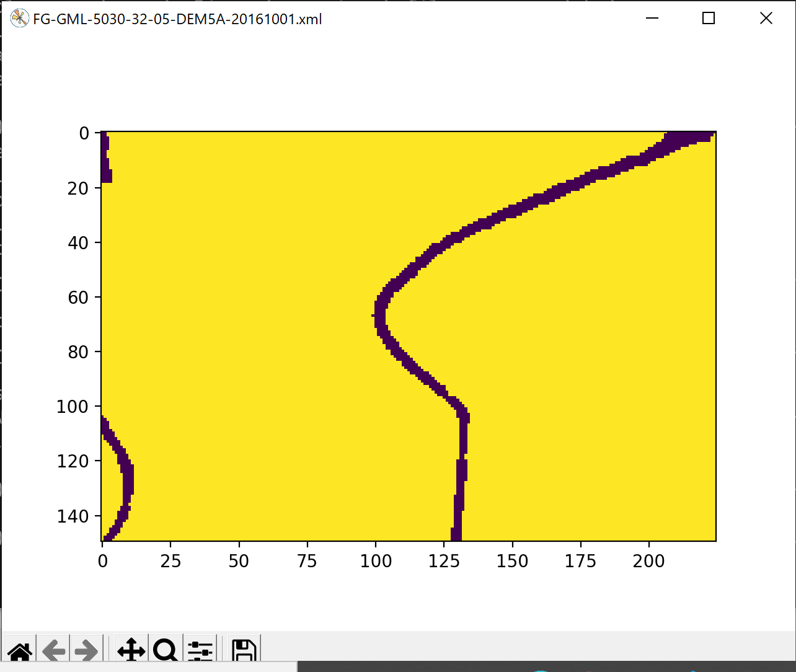
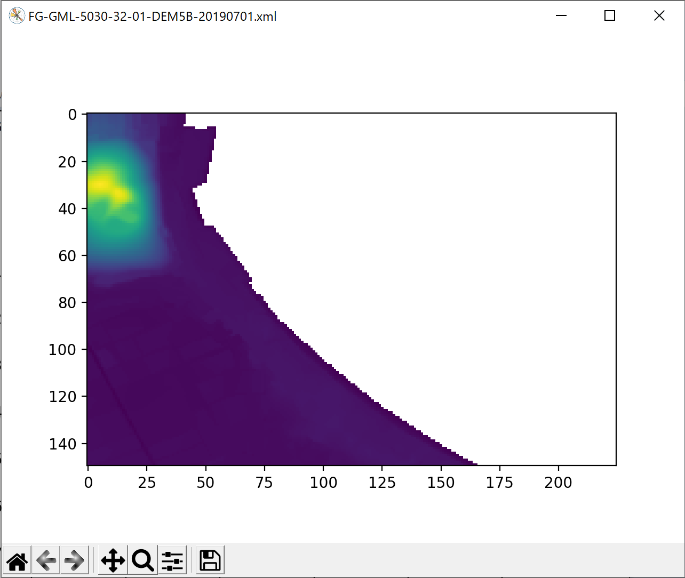
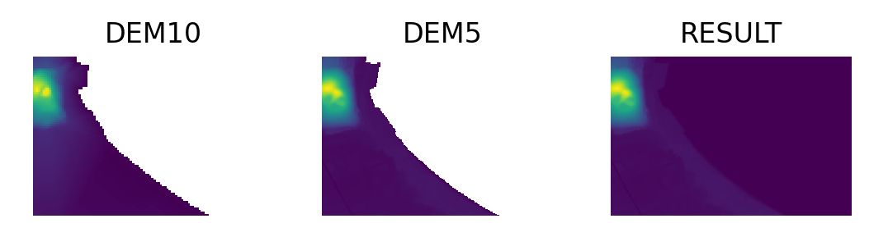
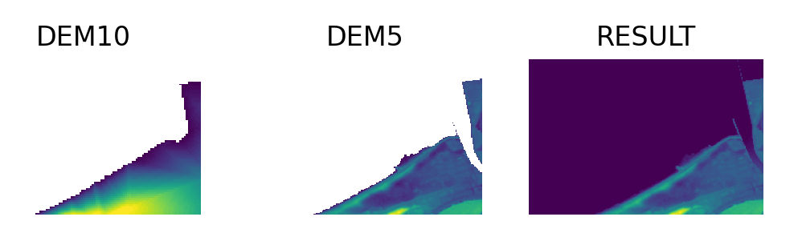
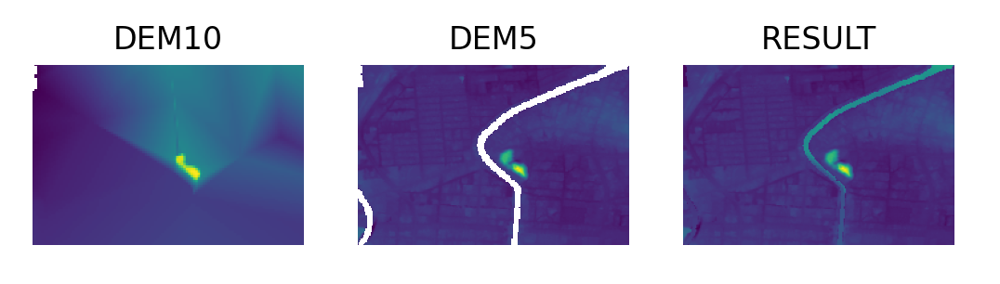

# DEMファイルツール

このプロジェクトは DEMファイルについて操作を行うツールを纏めたものである。

参考： DEMデータ取得元 https://fgd.gsi.go.jp/download/menu.php

## plot_dem.py

DEMファイルを読み込みそれを matplotlib で表示する

### 使用法

python plot_dem.py [--nodata <intvalue>] [--asis] input-file

--nodata <intvalue>  欠落値 このオプションが指定されなければ欠落値は -9999 となる。

--asis  表示する際、欠落値をそのまま表示する。このフラグが付けられなければ 欠落値は nan に置き換えられる。

### 出力サンプル

注：--asis オプションを付けて表示 このオプションは欠落値 -9999 がそのまま出力されるので、標準的な標高
と欠落値が大きくかけ離れるので表示自体が２色のように見えてしまう。

## merge_dems.py

DEM10 と DEM5 マージし、その結果を matplotlib で表示する。

指定ディレクトリ配下から DEM10, DEM5 ファイルをそれぞれ探し出し、２次メッシュが同一のものをマージする。

### 使用法

python merge_dems.py input-dir [mesh...]

mesh は 9999-99 という形式で２次メッシュを指定する。このパラメータを付けると指定されたメッシュのみのマージを行う。

### 出力サンプル

